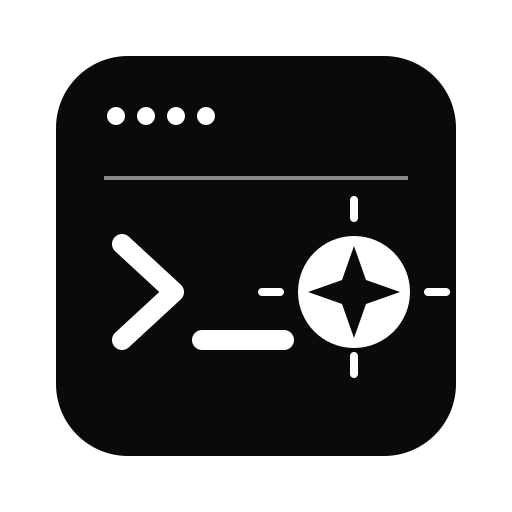

<p align="center">
  
</p>

<h1 align="center">Iris Agent</h1>

<p align="center">
  <a href="https://4onstudios.com/">Built by 4onStudios</a>
  ·
  <a href="https://github.com/4onstudios/iris-agent/issues">Issues</a>
  ·
  <a href="https://github.com/4onstudios/iris-agent/pulls">Contribute</a>
</p>

Iris Agent is the standalone coding-agent service used by [AIRIS](https://github.com/4onstudios/iris).

It provides streaming chat, workspace tools, LSP routes, MCP integration, command approvals, and run lifecycle APIs. It can run as:
- **HTTP Service** - RESTful API under `/api/agent`
- **CLI** - Interactive chat in the terminal
- **ACP Server** - Agent Client Protocol via stdio for seamless IDE integration

## Quick Start

This project can be installed and run with either npm or Yarn.

```sh
# npm
npm install
OPENAI_API_KEY=... npm start

# yarn
yarn install
yarn start
```

### HTTP Service

```sh
npm install
OPENAI_API_KEY=... npm start
```

The service listens on port `8080` by default. Set `PORT` to change it. `GET /health` reports service readiness.

### Using Iris Agent in an IDE

To run the standalone agent service for an IDE integration:

```bash
git clone https://github.com/4onstudios/iris-agent.git
cd iris-agent
npm install
npm start
```

The service listens on port `8080` by default and exposes its API under
`/api/agent`. Set `PORT` to use another port and configure
`AGENT_ALLOWED_ORIGINS` with the IDE's origin when browser CORS is required:

```bash
PORT=8080 AGENT_ALLOWED_ORIGINS=http://localhost:3000 npm start
```

The HTTP API is mounted below `/api/agent`. The main endpoints are:

| Endpoint | Purpose |
| --- | --- |
| `POST /api/agent/chat` | Send a message and optional workspace, model, history, tools, skills, MCP, and approval settings. |
| `GET /api/agent/runs/:runId` | Read the current run lifecycle snapshot. |
| `GET /api/agent/runs/:runId/events` | Read persisted run events. Supports `afterSequence` and `limit` (1-500). |
| `POST /api/agent/runs/:runId/cancel` | Request cancellation of a run. |
| `POST /api/agent/command-confirmation` | Approve or skip a pending command execution. |
| `GET /api/agent/skills` | List discovered skills. |
| `GET /api/agent/tools` | List native and MCP tools with their input schemas. |
| `GET /api/agent/slash-commands` | List enabled slash commands. |
| `POST /api/agent/mcp/inspect` | Inspect the tools exposed by one MCP server. |
| `POST /api/agent/mcp/call` | Invoke an MCP tool. |

The service also exposes file, chat-session, semantic-search, and LSP routes under
`/api/agent`. Those routes are intended for the AIRIS desktop client and are
implemented in [`api/`](./api/); use `GET /api/agent/tools` and
`GET /api/agent/skills` for runtime discovery.

Example chat request:

```sh
curl -X POST http://localhost:8080/api/agent/chat \
  -H 'Content-Type: application/json' \
  -d '{"message":"Explain this project","workspaceRoot":"/path/to/project"}'
```

Run lifecycle states and event payloads are returned by the run endpoints. Store
the returned `runId` from a chat response if the client needs polling,
progress-event retrieval, or cancellation.

### CLI Mode

```sh
OPENAI_API_KEY=... npm run cli -- --workspace /path/to/project --chat
```

This starts an interactive chat session in your terminal with access to the workspace.

### ACP Server

```sh
OPENAI_API_KEY=... npm run cli -- --workspace /path/to/project --acp
```

This starts an ACP (Agent Client Protocol) server over stdio, allowing IDE
integrations and other ACP clients to communicate with the agent. The `--port`
option is not used by the stdio transport.

## CLI Usage

```sh
iris-agent --workspace <path> [--acp | --chat] [--port <port>]
```

**Options:**
- `--workspace` (required) - Path to the workspace/project root
- `--acp` - Start ACP protocol server (stdio-based)
- `--chat` - Start interactive chat mode
- `--port <port>` - Retained for compatibility; ACP currently uses stdio and does not listen on a TCP port.

Short aliases are also available: `-w`, `-a`, `-c`, and `-p`. Running the CLI
without `--chat` or `--acp` prints help.

**Examples:**

```sh
# Interactive chat
npm run cli -- --workspace . --chat

# ACP server for IDE integration
npm run cli -- --workspace . --acp

# HTTP service (default)
npm start
```

## Browser Client

Configure the precise browser origins permitted to call this service:

```sh
AGENT_ALLOWED_ORIGINS=https://airis.4onstudios.com npm start
```

Multiple origins may be supplied as a comma-separated list. Requests without an `Origin` header (such as a local CLI or reverse proxy) are accepted; browser origins are denied unless explicitly configured.

## Providers

Configure the API key for the model provider selected by the client:

- `OPENAI_API_KEY`
- `ANTHROPIC_API_KEY`
- `GOOGLE_GENERATIVE_AI_API_KEY`
- `OPENROUTER_API_KEY`
- `OLLAMA_API_KEY`

Provider-specific configuration:

| Variable | Description |
| --- | --- |
| `OLLAMA_BASE_URL` | Ollama-compatible server URL. |
| `OPENROUTER_BASE_URL` | OpenRouter-compatible API URL. |
| `OPENROUTER_SITE_URL` / `OPENROUTER_SITE_NAME` | Optional OpenRouter request metadata. |
| `ANTHROPIC_BETA` / `ANTHROPIC_BETAS` | Optional Anthropic beta headers. |
| `HF_TOKEN` | Hugging Face authentication where required by a configured provider. |

### Runtime configuration

| Variable | Description |
| --- | --- |
| `PORT` | HTTP listening port; defaults to `8080`. |
| `AGENT_ALLOWED_ORIGINS` | Comma-separated browser origins allowed by CORS. Requests without an `Origin` header are allowed. |
| `DATABASE_URL` | Database connection URL used by the configured agent storage. |
| `IRIS_AGENT_RUNS_DB_PATH` | SQLite path for persisted run lifecycle data. |
| `IRIS_BACKEND_SERVICE` | Selects the backend service integration. |
| `IRIS_AGENT_PREFERRED_AGENT_ID` | Preferred external agent identifier. |
| `IRIS_AGENT_EXTERNAL_AGENT_MANIFEST_PATH` | Path to an external-agent manifest. |
| `IRIS_AGENT_GIT_SAFETY_MODE` | Git safety policy; defaults to `suggest`. |
| `IRIS_AGENT_AUTO_LINT` / `IRIS_AGENT_AUTO_TEST` | Enable automatic lint/test validation. |
| `IRIS_AGENT_LINT_CMD` / `IRIS_AGENT_TEST_CMD` | Override validation commands. |
| `IRIS_AGENT_AUTO_FIX_VALIDATION` | Enable automatic validation fixes. |
| `IRIS_AGENT_INPUT_TOKEN_LIMIT` / `IRIS_AGENT_MAX_OUTPUT_TOKENS` | Token-budget controls. |
| `IRIS_AGENT_PROMPT_TOKEN_BUDGET_RATIO` | Prompt budget ratio. |
| `IRIS_AGENT_MODEL_RETRY_ATTEMPTS` | Model request retry count. |
| `IRIS_AGENT_REFLECTION_MAX` / `IRIS_AGENT_REFLECTION_MAX_STEPS` | Reflection-loop limits. |
| `IRIS_AGENT_REFLECTION_RETRY_ATTEMPTS` | Reflection retry count. |
| `IRIS_AGENT_REFLECTION_NO_PROGRESS_REPEATS` | Maximum repeated no-progress reflection cycles. |
| `IRIS_ENABLE_SLASH_COMMANDS` | Enable slash-command handling. |
| `IRIS_DEBUG_TOKEN_USAGE_SOURCE` | Enable token-usage diagnostics. |
| `IRIS_AGENT_STREAM_RETRY_ENABLED` | Enable stream retries. Related retry delay and limit variables are supported by the runtime. |
| `IRIS_VERBOSE_SKILL_DISCOVERY` | Enable verbose skill-discovery logging. |
| `BROWSER_NO_SANDBOX` | Set to `true` only when browser automation must run without a sandbox. |

Environment values can be supplied in a local `.env` file for the HTTP server
because it loads `dotenv/config`. Do not commit `.env` files or API keys.

### Desktop authentication

Desktop-only routes require both `TAURI_BUNDLED=1` and `IRIS_DESKTOP_TOKEN`.
Clients send the token in the `X-Desktop-Token` header. These protected routes
include key management, file operations, remote chat-session synchronization,
and MCP inspection/calls. Do not expose the desktop token to browsers.

### Persistence

Run lifecycle data is stored in SQLite. Set `IRIS_AGENT_RUNS_DB_PATH` to choose
the database location; otherwise it is stored at `~/.iris/agent-runs.sqlite`.
Chat sessions are stored as JSON files under `~/.iris/chat-sessions/` and are
managed through the desktop synchronization routes.

### MCP and approvals

MCP servers are supplied in chat requests or MCP route payloads. Use
`POST /api/agent/mcp/inspect` to discover tools before calling
`POST /api/agent/mcp/call`. MCP tool names must start with `mcp_`.
Commands that require approval pause until the client submits
`POST /api/agent/command-confirmation` with a `confirmationId` and boolean
`approved` value.

## ACP Protocol

The ACP server supports the following custom RPC methods:

- `chat` - Send a message to the agent
  - **Params:** `{ message: string }`
  - **Response:** `{ success: boolean, response: any }`

- `list_tools` - Get available tools
  - **Params:** `{}`
  - **Response:** `{ tools: Tool[] }`

- `list_skills` - Get available skills
  - **Params:** `{}`
  - **Response:** `{ skills: string[] }`

- `workspace_info` - Get workspace metadata
  - **Params:** `{}`
  - **Response:** `{ workspaceRoot: string, timestamp: string, agentVersion: string }`

## Development

```sh
npm run typecheck
npm run build
npm test
```

The repository also provides Make targets:

```sh
make test  # npm test with Jest's serial/forced-exit flags
make run   # npm start
make dev   # npm run dev
```

For production, run the compiled output from a process supervisor, restrict
`AGENT_ALLOWED_ORIGINS`, keep provider credentials in a secret store, protect
the HTTP service behind TLS/authentication, and use a writable persistent
location for the run database.

## Contributing

Contributions are welcome. To get started:

1. Fork the repository and create a focused branch.
2. Install dependencies with `npm install`.
3. Run `npm run typecheck` and `npm test` before opening a pull request.
4. Include a clear description of the problem, the approach, and validation.

Please keep changes focused, avoid committing secrets, and open an issue first
for larger feature proposals.

The project logo is available at
[`assets/iris-agent-logo.svg`](./assets/iris-agent-logo.svg) for repository and
community references. Keep the logo unchanged when using it as the project
mark.

This project is released under the [MIT License](LICENSE).
